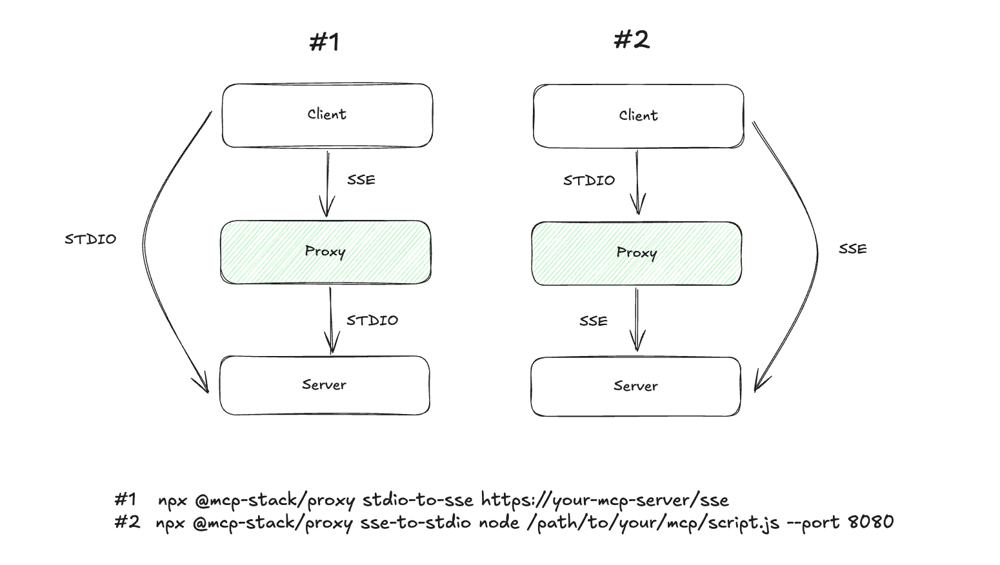

# mcp-proxy

  
  
  
  

Implements protocol conversion between SSE and stdio

## Motivation

  

When either the client or the server does not support a particular protocol, protocol conversion becomes necessary. For example, some typical scenarios include:

1. Claude or some other clients does not support the SSE protocol.
2. We want to deploy an MCP Server that only supports stdio.

Now you can use this tool to solve the problem.
