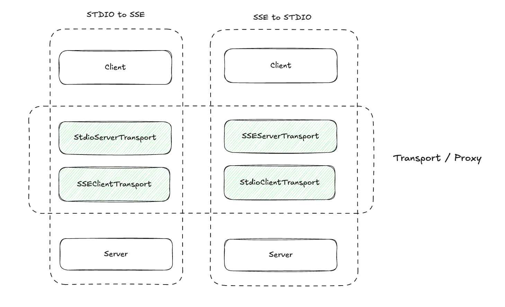

# mcp-proxy

<p>
  <a href="https://github.com/L-Qun/mcp-proxy/actions/workflows/ci.yml"></a>
  <a href= "https://github.com/prettier/prettier"></a>
  <a href="https://github.com/facebook/jest"></a>
  <a href="CONTRIBUTING.md#pull-requests"></a>
  <a href="#license"></a>
</p>

实现了 SSE 与 STDIO 之间的协议转换

使用其他语言阅读：[English](./README.MD) | 简体中文

## 动机

<div align="center">
  
</div>

MCP 协议转换在一些场景非常重要，比如：

1. Claude 或者一些其他的客户端不支持 SSE 协议。
2. 我们希望将基于 STDIO 协议的 MCP Server 进行部署。

现在你可以使用这个工具来解决这个问题。

## 用法

- SSE 转换为 STDIO

```
 npx @mcp-stack/proxy stdio-to-sse https://your-mcp-server/sse
```

- STDIO 转换为 SSE

```
npx @mcp-stack/proxy sse-to-stdio node /path/to/your/mcp/script.js --port 8080
```

## 背后

<div align="center">
  
</div>
